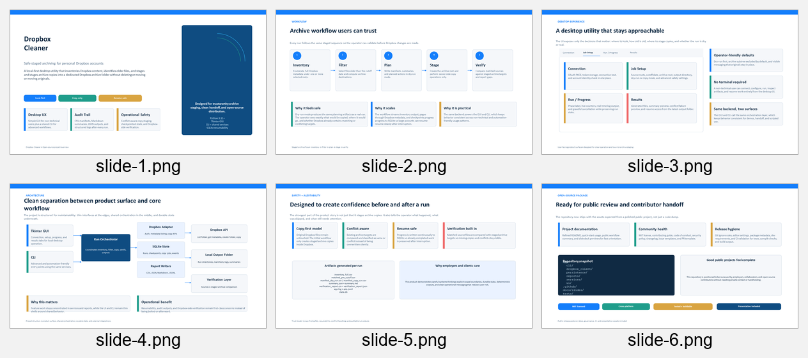

# Dropbox Cleaner

Local-first desktop utility for inventorying Dropbox content, identifying files older than a cutoff date, and staging archive copies into a dedicated Dropbox archive folder without touching the originals.

Dropbox Cleaner now supports both:

- personal Dropbox accounts
- Dropbox team accounts through a single admin-authorized app in `team_admin` mode

It inventories first, plans first, writes manifests and logs, and only performs server-side copy operations when you explicitly choose a real copy run.

## Highlights

- Consumer-friendly guided desktop UI plus CLI
- Shared backend for GUI and CLI
- Personal mode and team-admin mode
- Full metadata traversal with pagination
- Namespace-aware team inventory and resumable copy state
- Cutoff filtering based on `server_modified`, `client_modified`, or the oldest of both
- Dry-run mode with planned manifests
- Safe copy-first archive staging inside Dropbox
- SQLite-backed resumability, logs, verification, and summaries

## Preview

- Presentation deck: [docs/slides/DropboxCleaner_Open_Source_Overview.pptx](docs/slides/DropboxCleaner_Open_Source_Overview.pptx)
- Rendered slide previews: [docs/slides/rendered](docs/slides/rendered)



## What It Does

- Connects through the official Dropbox Python SDK
- Enumerates files and folders under selected personal roots or team namespaces
- Exports a full inventory CSV
- Identifies files older than a user-selected cutoff date
- Exports a matched-file CSV with planned archive destinations
- Creates or reuses a dedicated archive location such as `/Archive_PreMay2020`
- Preserves original folder structure under the archive root
- Writes manifests, logs, summaries, and verification reports
- Supports safe resume after interruption

## What It Does Not Do

- It does not delete originals
- It does not move originals
- It does not ask for your Dropbox password
- It does not silently overwrite archive files
- It does not rely on Dropbox search
- It does not download and re-upload files for v1 team-admin workflows

## Requirements

- Python 3.11+
- A Dropbox API app
- PySide6 is installed from `requirements.txt` for the desktop UI

Recommended app scopes by mode:

- Personal:
  - `account_info.read`
  - `files.metadata.read`
  - `files.content.read`
  - `files.content.write`
- Team Admin:
  - `account_info.read`
  - `files.metadata.read`
  - `files.content.read`
  - `files.content.write`
  - `team_info.read`
  - `members.read`
  - `team_data.member`
  - `sharing.read`
  - `sharing.write`
  - `files.team_metadata.read`
  - `files.team_metadata.write`
  - `team_data.team_space`

## Install

```powershell
py -3.11 -m venv .venv
.venv\Scripts\Activate.ps1
py -3.11 -m pip install -r requirements.txt
py -3.11 -m pip install -r requirements-dev.txt
```

## Run The GUI

```powershell
py -3.11 -m app
```

The GUI walks non-technical users through:

- choosing `Personal Dropbox` or `Team Dropbox`
- connecting with OAuth
- choosing a cutoff date with a calendar
- browsing Dropbox folders for archive/source paths
- previewing or copying archive files
- reviewing visual results, issues, and output files

## Run The CLI

```powershell
py -3.11 -m app.cli.main --help
```

## Build Double-Click Apps

Packaging instructions are in [docs/PACKAGING.md](docs/PACKAGING.md).
GitHub Actions also builds unsigned zipped Windows and macOS artifacts for pull requests, pushes to `main`/`master`, and manual workflow runs.

Windows:

```powershell
.\scripts\build_windows.ps1
```

macOS:

```bash
./scripts/build_macos.sh
```

## Authentication

Recommended flow:

1. Create a Dropbox app in the Dropbox App Console.
2. Choose the correct app type for your mode:
   - personal user-linked app for personal mode
   - team-linked app for `team_admin` mode
3. Enable the required scopes.
4. Use OAuth PKCE in the GUI or `oauth-link`.
5. Re-authorize if you later add or change scopes.

The app never asks for your Dropbox password and does not log tokens.

## Common Workflows

### Personal Inventory Only

```powershell
py -3.11 -m app.cli.main inventory ^
  --account-mode personal ^
  --use-saved-auth ^
  --source-root / ^
  --output-dir ./outputs
```

### Personal Dry Run

```powershell
py -3.11 -m app.cli.main dry-run ^
  --account-mode personal ^
  --use-saved-auth ^
  --source-root /Team ^
  --cutoff-date 2020-05-01 ^
  --date-filter-field server_modified ^
  --archive-root /Archive_PreMay2020 ^
  --output-dir ./outputs
```

### Team-Admin Dry Run

```powershell
py -3.11 -m app.cli.main dry-run ^
  --account-mode team_admin ^
  --use-saved-auth ^
  --team-coverage-preset all_team_content ^
  --date-filter-field server_modified ^
  --archive-root /Archive_PreMay2020 ^
  --output-dir ./outputs
```

### Team-Admin Copy Run

```powershell
py -3.11 -m app.cli.main copy ^
  --account-mode team_admin ^
  --use-saved-auth ^
  --team-coverage-preset all_team_content ^
  --date-filter-field server_modified ^
  --archive-root /Archive_PreMay2020 ^
  --output-dir ./outputs
```

### Cutoff Date Field

The default cutoff field is `server_modified`, which is the Dropbox API timestamp for when Dropbox last changed the file on the server. This is the safest audit default.

If Dropbox's web UI shows old file dates but a run does not match those files, check `inventory_full.csv`. If `server_modified` is recent and `client_modified` is old, rerun with `client_modified` or `oldest_modified`.

```powershell
py -3.11 -m app.cli.main dry-run ^
  --account-mode team_admin ^
  --use-saved-auth ^
  --team-coverage-preset all_team_content ^
  --cutoff-date 2020-05-01 ^
  --date-filter-field oldest_modified ^
  --archive-root /Archive_PreMay2020
```

### Resume

```powershell
py -3.11 -m app.cli.main resume ^
  --account-mode team_admin ^
  --use-saved-auth ^
  --job-state ./outputs/your-run-folder/state.db
```

### Verify

```powershell
py -3.11 -m app.cli.main verify ^
  --account-mode team_admin ^
  --use-saved-auth ^
  --job-state ./outputs/your-run-folder/state.db
```

## Team-Admin Notes

- `team_admin` mode is designed for whole-team inventory from one admin-authorized app.
- The default coverage preset is `all_team_content`.
- Team reports and manifests are namespace-aware and include:
  - `account_mode`
  - `namespace_id`
  - `namespace_type`
  - `namespace_name`
  - `member_id`
  - `member_email`
  - `member_display_name`
  - `canonical_source_path`
  - `archive_bucket`
- In team mode, the archive layout is bucketed to avoid collisions:
  - `/Archive_PreMay2020/team_space/...`
  - `/Archive_PreMay2020/member_homes/<member-slug>/...`
  - `/Archive_PreMay2020/shared_namespaces/<namespace-slug>/...`

## Troubleshooting

### Team copy run says `no_write_permission`

Some Dropbox team-space policies block API-created top-level folders even for admin-authorized apps. If a copy run reports `blocked_precondition` or `no_write_permission` while creating the archive folder, create the archive folder manually in Dropbox or choose an existing team-space folder where the authenticated admin/app has editor access. Then use Resume; originals are not deleted or moved.

### Files appear in inventory but are not matched

The filter uses `server_modified` by default. Imported or copied files can have an old `client_modified` date while Dropbox reports a recent `server_modified` date. In that case, choose `client_modified` or `oldest_modified` in the GUI's Date Filter Field, or pass `--date-filter-field oldest_modified` in the CLI.

## Outputs

Every run creates a timestamped output folder with:

- `inventory_full.csv`
- `matched_pre_cutoff.csv`
- `manifest_dry_run.csv` or `manifest_copy_run.csv`
- `summary.json`
- `summary.md`
- `verification_report.csv`
- `verification_report.json`
- `app.log`
- `app.jsonl`
- `state.db`

## Development

```powershell
py -3.11 -m pytest -q
py -3.11 -m compileall app tests
py -3.11 -m build
```

## Community

- Contribution guide: [CONTRIBUTING.md](CONTRIBUTING.md)
- Security policy: [SECURITY.md](SECURITY.md)
- Code of conduct: [CODE_OF_CONDUCT.md](CODE_OF_CONDUCT.md)
- Changelog: [CHANGELOG.md](CHANGELOG.md)

## License

[MIT](LICENSE)
