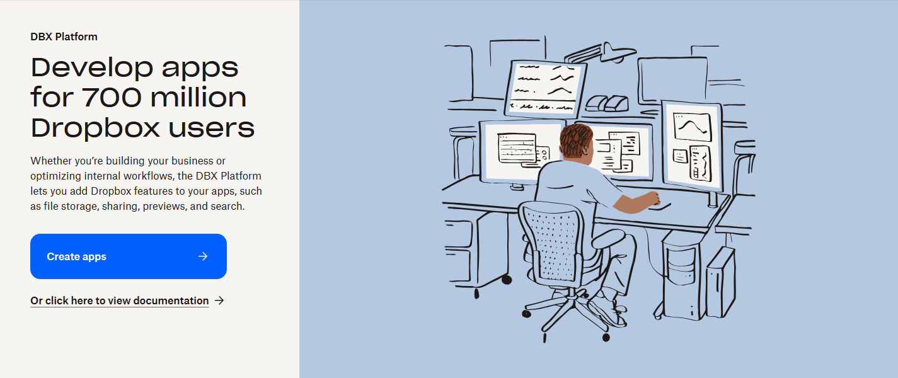
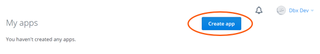
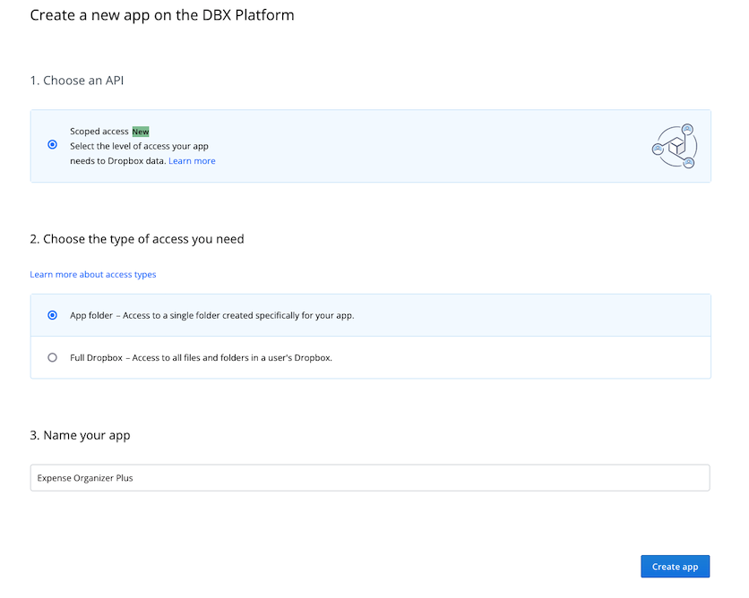
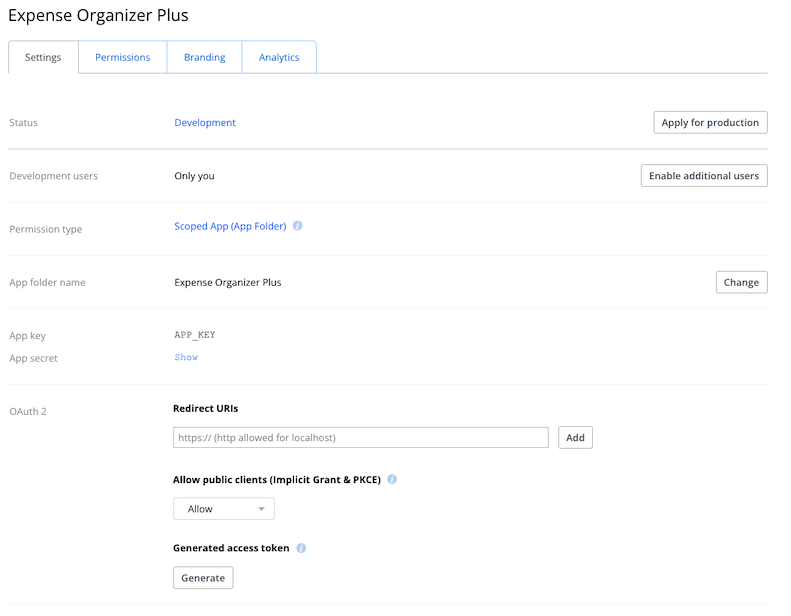
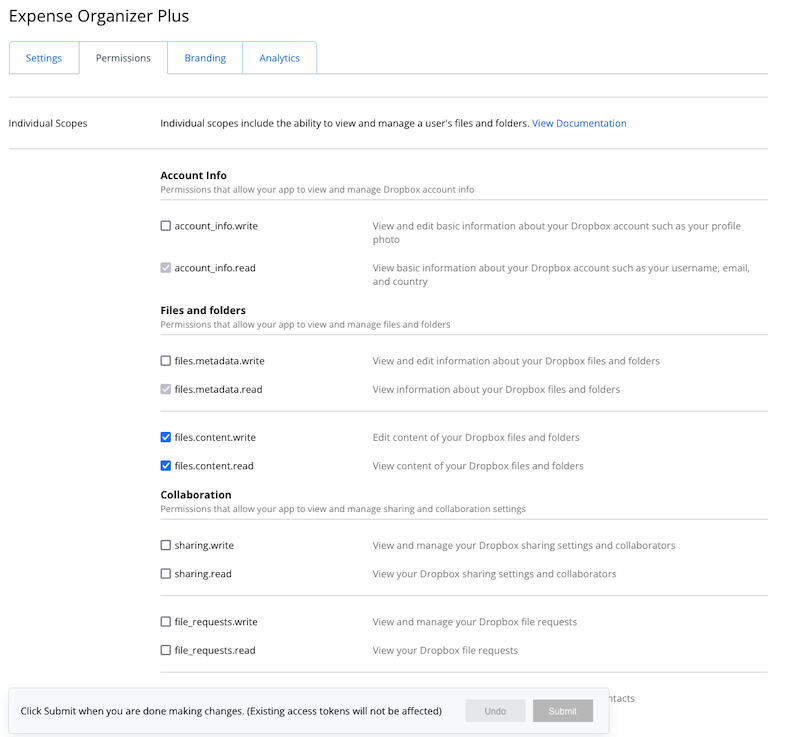
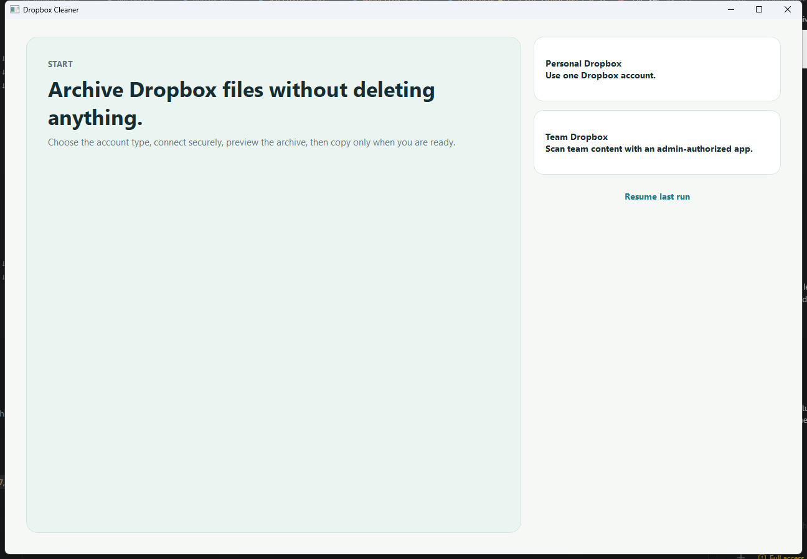

# Dropbox Cleaner Setup Guide

This guide is for a non-technical user. It explains how to:

1. create a Dropbox app
2. enable the correct Dropbox permissions
3. connect that app to Dropbox Cleaner
4. run a safe first test

This guide covers both:

- `Personal Dropbox`
- `Team Dropbox` (admin only)

Nothing in this guide deletes or moves your original files.

## Before You Start

You will need:

- a Dropbox account
- Dropbox Cleaner installed on your computer
- internet access
- for `Team Dropbox`: a Dropbox team admin account

Important:

- Dropbox Cleaner does **not** ask for your Dropbox password.
- Dropbox authorization happens in your web browser.
- If you change app permissions later, you must reconnect the app in Dropbox Cleaner.

## Which Option Should You Choose?

Choose **Personal Dropbox** if:

- you are archiving files in your own personal Dropbox
- you do not need to scan a company team account

Choose **Team Dropbox** if:

- you want one admin-approved app to inventory and archive team content
- you are a Dropbox team admin

## Part 1: Open Dropbox Developers

1. Open this page in your browser:
   - https://www.dropbox.com/developers
2. Click **App Console**.
3. Sign in with Dropbox if Dropbox asks you to.
4. Click **Create app**.

> [SCREENSHOT PLACEHOLDER 1]
> Replace with: Dropbox Developers page showing the **App Console** button.

> [SCREENSHOT PLACEHOLDER 2]
> Replace with: App Console page showing the **Create app** button.

## Part 2: Create the App

Dropbox's app-creation screen can change over time. The wording may be slightly different from what you see below. If it is different, choose the option that is closest to the description in this guide.

### If You Are Setting Up Personal Dropbox

1. Choose **Scoped access** if Dropbox asks for the app type.
2. Choose **Full Dropbox** access.
   - Do **not** choose `App folder`.
   - Dropbox Cleaner needs to inventory your selected Dropbox folders, so it needs broader file access.
3. Give the app a name.
   - Example: `Dropbox Cleaner Personal`
4. Click **Create app**.

### If You Are Setting Up Team Dropbox

1. Choose the Dropbox app type for **team/business access** if Dropbox shows separate personal vs team options.
2. Choose **Scoped access** if Dropbox asks.
3. Choose the option that gives access to the **full team Dropbox / full Dropbox / team file access**.
   - Do **not** choose `App folder`.
4. Give the app a name.
   - Example: `Dropbox Cleaner Team Admin`
5. Click **Create app**.

Tip:

- If Dropbox shows both a personal app option and a team-linked app option, choose the **team-linked** option for `Team Dropbox`.

> [SCREENSHOT PLACEHOLDER 3]
> Replace with: Dropbox app creation wizard showing the access-type choices.

## Part 3: Copy the App Key

After the app is created, Dropbox opens the app settings page.

1. Stay on the **Settings** tab.
2. Find the **App key**.
3. Copy it.
4. Paste it into a temporary note for later, or leave this page open.

You usually do **not** need the App secret for Dropbox Cleaner's normal setup.

> [SCREENSHOT PLACEHOLDER 4]
> Replace with: App settings page showing where the **App key** appears.

## Part 4: Turn On the Correct Permissions

1. In the Dropbox App Console, open the **Permissions** tab.
2. Turn on the permissions listed below for your mode.
3. If Dropbox shows a **Submit**, **Save**, or similar button, click it.

### Personal Dropbox Permissions

Turn on these permissions:

- `account_info.read`
- `files.metadata.read`
- `files.content.read`
- `files.content.write`

### Team Dropbox Permissions

Turn on these permissions:

- `account_info.read`
- `files.metadata.read`
- `files.content.read`
- `files.content.write`
- `team_info.read`
- `members.read`
- `team_data.member`
- `sharing.read`
- `sharing.write`
- `files.team_metadata.read`
- `files.team_metadata.write`
- `team_data.team_space`

Important:

- If you add or change permissions later, Dropbox Cleaner must be reconnected so Dropbox can grant the new scopes.

> [SCREENSHOT PLACEHOLDER 5]
> Replace with: Permissions tab showing the required checkboxes.

## Part 5: If You Use Team Dropbox, Make Sure Your Team Allows the App

Some Dropbox teams block custom apps by default. If you use `Team Dropbox`, check this before you connect:

1. Sign in to Dropbox as a team admin.
2. Open the **Admin console**.
3. Go to **Settings**.
4. Open the **Integrations** tab.
5. Check whether custom or registered integrations are blocked.
6. If needed, allow your new app.

If Dropbox asks for an app key or app ID:

- the app key is on your app's page in the Dropbox App Console

> [SCREENSHOT PLACEHOLDER 6]
> Replace with: Dropbox Admin Console -> Settings -> Integrations page.

## Part 6: Connect the App in Dropbox Cleaner

1. Open **Dropbox Cleaner**.
2. On the first screen, choose:
   - **Personal Dropbox**, or
   - **Team Dropbox**
3. On the connection screen, paste the **App key**.
4. Click **Connect Dropbox**.
5. Your browser opens to Dropbox.
6. Sign in if Dropbox asks you to.
7. Review the app name and permissions.
8. Click **Allow**.
9. Dropbox shows an authorization code.
10. Copy that code.
11. Go back to Dropbox Cleaner.
12. Paste the code into **Authorization code**.
13. Click **Finish connection**.
14. When Dropbox Cleaner shows that the connection is verified, click **Continue**.

This is the Dropbox Cleaner start screen you will see before you choose `Personal Dropbox` or `Team Dropbox`:

> [SCREENSHOT PLACEHOLDER 7]
> Replace with: Dropbox Cleaner connection screen with the App key field and Connect button.

> [SCREENSHOT PLACEHOLDER 8]
> Replace with: Dropbox authorization page in the browser showing the Allow button.

## Part 7: Do a Safe First Test

Your first run should be a safe preview.

1. In Dropbox Cleaner, choose a cutoff date.
2. Choose an archive folder.
3. For your first test, select **Preview archive**.
4. Click **Start**.
5. Wait for the scan to finish.
6. Review the results.

Preview mode is safe because:

- it does **not** make Dropbox changes
- it shows what would be copied
- it writes reports you can review first

Recommended first test:

- use a small test folder or an older date range you can verify easily

## Part 8: What to Do After Preview Works

Once the preview looks correct:

1. go back to settings
2. switch from **Preview archive** to **Copy to archive**
3. run again

Dropbox Cleaner will:

- copy matching files into the archive
- preserve folder structure
- keep the originals in place

It will **not**:

- delete originals
- move originals
- overwrite existing archive files silently

## Common Problems and Fixes

### Problem: "The app does not have the required scope"

Cause:

- one or more Dropbox permissions were not enabled

Fix:

1. go back to the Dropbox App Console
2. open **Permissions**
3. enable the missing permissions
4. save changes if Dropbox shows a save button
5. reconnect the app in Dropbox Cleaner

### Problem: Team app cannot connect

Cause:

- the Dropbox team blocks custom apps
- or the approving user is not a team admin

Fix:

1. sign in as a team admin
2. check **Admin console -> Settings -> Integrations**
3. allow the app if needed
4. reconnect

### Problem: Copy run says `no_write_permission`

Cause:

- the archive folder is in a Dropbox location where the app or admin does not have editor access

Fix:

1. choose a different archive folder
2. or create the archive folder manually in Dropbox first
3. rerun or resume the job

### Problem: Files look old in Dropbox but do not match

Cause:

- Dropbox Cleaner may be comparing `Dropbox modified date` instead of the file's original date

Fix:

1. in Dropbox Cleaner, change the date field to:
   - **Original file date**, or
   - **Oldest available date**
2. run the preview again

## Best Practice Recommendations

- Use **Personal Dropbox** for a personal account.
- Use **Team Dropbox** only with a real team admin account.
- Start with **Preview archive** before any copy run.
- Keep the archive folder somewhere the app can write to.
- If you change Dropbox app permissions, reconnect the app afterward.
- Keep your app key private.

## Suggested Screenshot List

If you want to replace the placeholders, these are the screenshots to capture:

1. Dropbox Developers page with **App Console**
2. App Console page with **Create app**
3. App creation wizard with access choices
4. App **Settings** page showing the **App key**
5. App **Permissions** tab with required scopes checked
6. Dropbox **Admin console -> Settings -> Integrations** for team setups
7. Dropbox Cleaner connection screen
8. Dropbox browser authorization page
9. Dropbox Cleaner preview results page
10. Dropbox Cleaner copy results page

## Official Dropbox References

These official Dropbox pages were used to build this guide:

- Dropbox Getting Started:
  - https://www.dropbox.com/developers/reference/getting-started
- Dropbox OAuth Guide:
  - https://developers.dropbox.com/oauth-guide
- Dropbox Developer Guide:
  - https://www.dropbox.com/developers/reference/developer-guide
- Dropbox Help: Manage apps for your Dropbox team:
  - https://help.dropbox.com/integrations/app-integrations

Key Dropbox guidance reflected here:

- Dropbox apps are created in the **App Console**
- permissions are enabled on the **Permissions** tab
- desktop apps that need background access should use **OAuth code flow with PKCE and refresh tokens**
- team admins can allow or block apps in the **Admin console -> Settings -> Integrations**
