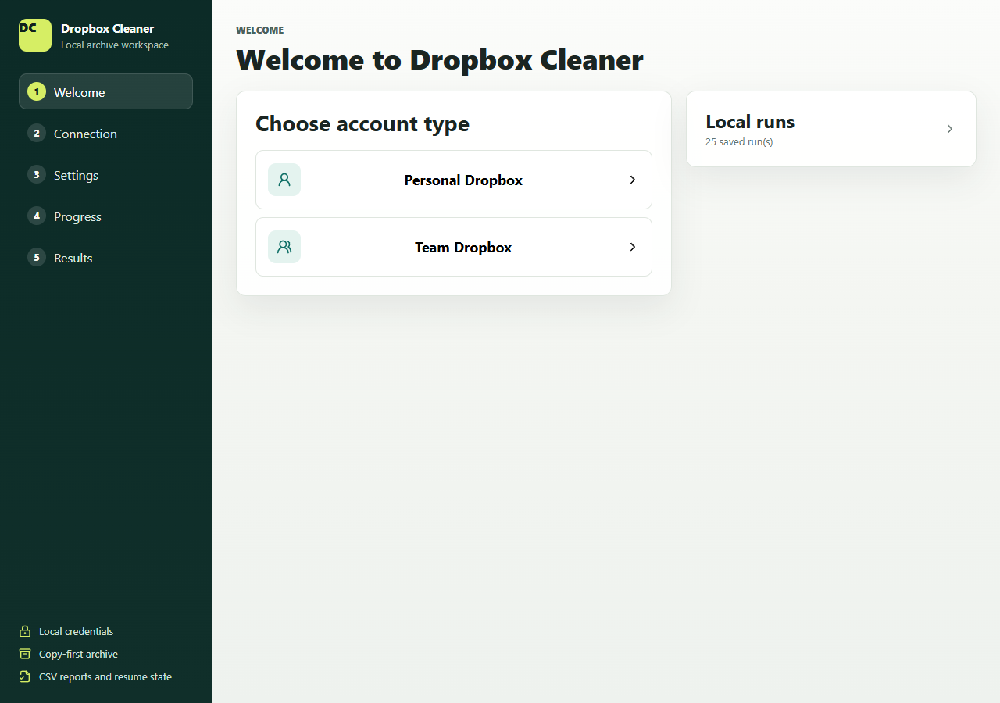
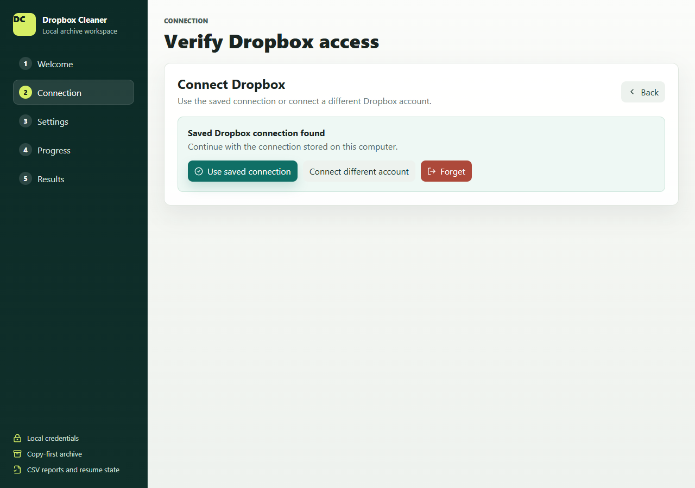
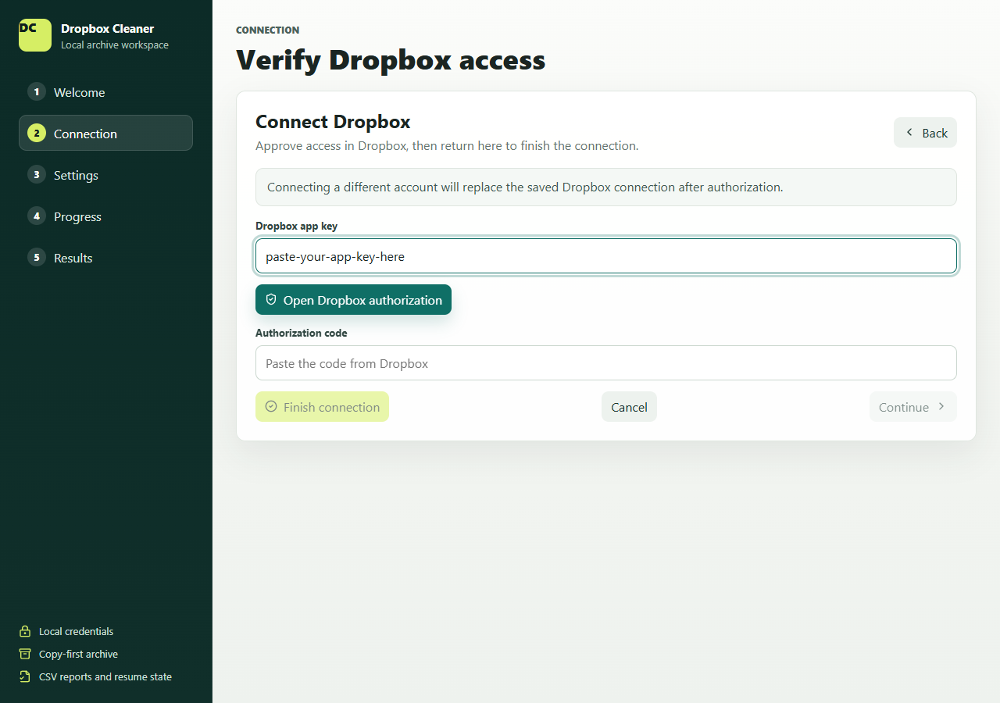
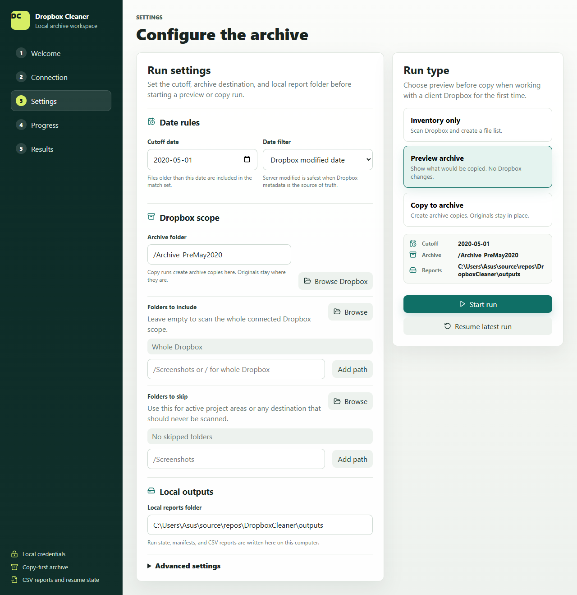
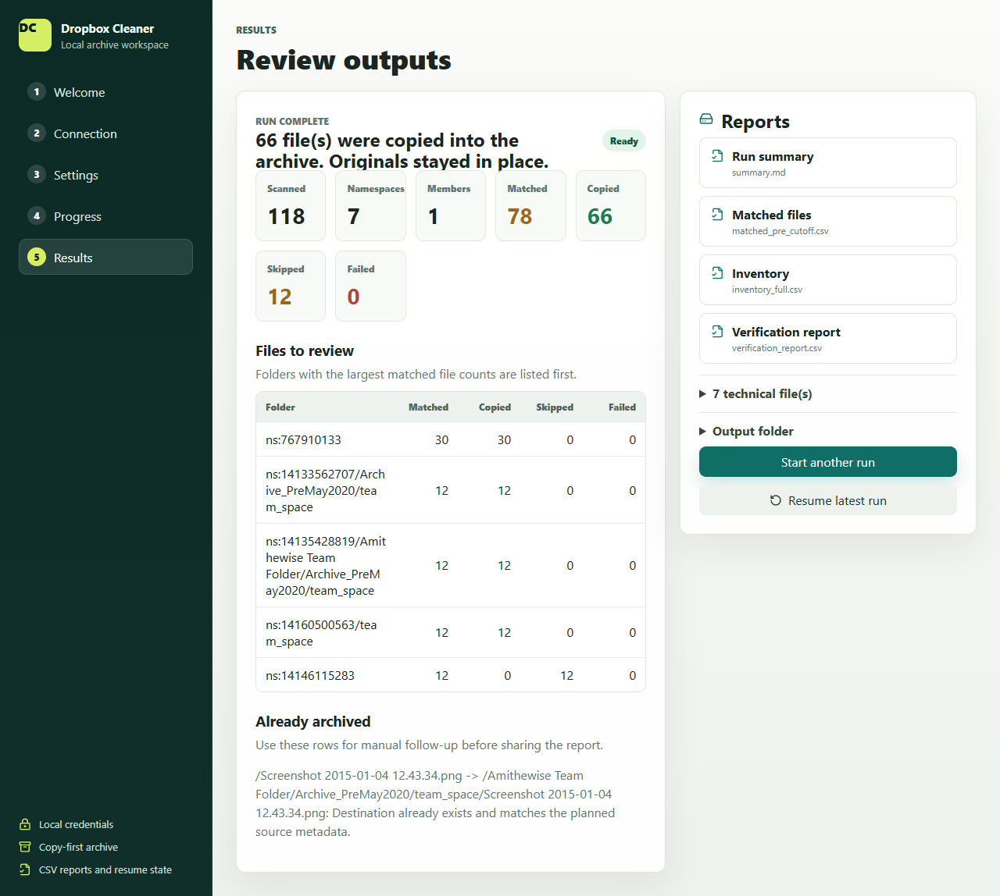

# Dropbox Cleaner Setup Guide

This guide explains how to create a Dropbox app, connect it to Dropbox Cleaner, and run a safe first preview in the local browser UI.

Dropbox Cleaner does not delete or move your original files. Preview runs make no Dropbox changes. Copy runs create archive copies and keep originals in place.

## Before You Start

You will need:

- a Dropbox account
- Dropbox Cleaner installed on your computer
- internet access
- for Team Dropbox: a Dropbox team admin account

Important:

- Dropbox Cleaner does not ask for your Dropbox password.
- Dropbox authorization happens in your web browser.
- Dropbox Cleaner opens a local browser page on this computer.
- If you change Dropbox app permissions later, reconnect the app in Dropbox Cleaner.

## Choose Account Type

Choose Personal Dropbox if:

- you are archiving files in your own Dropbox
- you do not need to scan a company team account

Choose Team Dropbox if:

- you want one admin-approved app to inventory and archive team content
- you are a Dropbox team admin

## Part 1: Open Dropbox Developers

1. Open this page in your browser:
   - https://www.dropbox.com/developers
2. Click App Console.
3. Sign in with Dropbox if Dropbox asks you to.
4. Click Create app.

## Part 2: Create the App

Dropbox's app-creation screen can change over time. If the wording is different, choose the option closest to the description below.

### Personal Dropbox App

1. Choose Scoped access if Dropbox asks for the app type.
2. Choose Full Dropbox access.
   - Do not choose App folder.
   - Dropbox Cleaner needs to inventory your selected Dropbox folders.
3. Give the app a name.
   - Example: Dropbox Cleaner Personal
4. Click Create app.

### Team Dropbox App

1. Choose the Dropbox app type for team or business access if Dropbox shows separate personal and team options.
2. Choose Scoped access if Dropbox asks.
3. Choose the option that gives access to the full team Dropbox, full Dropbox, or team file access.
   - Do not choose App folder.
4. Give the app a name.
   - Example: Dropbox Cleaner Team Admin
5. Click Create app.

Tip: If Dropbox shows both a personal app option and a team-linked app option, choose the team-linked option for Team Dropbox.

## Part 3: Copy the App Key

After the app is created, Dropbox opens the app settings page.

1. Stay on the Settings tab.
2. Find the App key.
3. Copy it.
4. Keep this page open or paste the app key into a temporary note.

You usually do not need the App secret for Dropbox Cleaner's normal setup.

## Part 4: Enable Permissions

1. In the Dropbox App Console, open the Permissions tab.
2. Turn on the permissions listed below for your mode.
3. If Dropbox shows a Submit, Save, or similar button, click it.

### Personal Dropbox Permissions

Turn on these permissions:

- `account_info.read`
- `files.metadata.read`
- `files.content.read`
- `files.content.write`

### Team Dropbox Permissions

Turn on these permissions:

- `account_info.read`
- `files.metadata.read`
- `files.content.read`
- `files.content.write`
- `team_info.read`
- `members.read`
- `team_data.member`
- `sharing.read`
- `sharing.write`
- `files.team_metadata.read`
- `files.team_metadata.write`
- `team_data.team_space`

Important: If you add or change permissions later, Dropbox Cleaner must be reconnected so Dropbox can grant the new scopes.

## Part 5: Team Dropbox Admin Check

Some Dropbox teams block custom apps by default. If you use Team Dropbox, check this before connecting:

1. Sign in to Dropbox as a team admin.
2. Open the Admin console.
3. Go to Settings.
4. Open the Integrations or App permissions area.
5. Check whether custom or registered integrations are blocked.
6. If needed, allow your new app.

If Dropbox asks for an app key or app ID, use the app key from the Dropbox App Console.

## Part 6: Open Dropbox Cleaner

1. Start Dropbox Cleaner from the provided shortcut or command.
2. Your browser opens the local Dropbox Cleaner page.
3. On the welcome screen, choose Personal Dropbox or Team Dropbox.

The app runs locally on your computer. The browser page is only for controlling the local Dropbox Cleaner process.

Local runs are collapsed by default. Open Local runs only when you want to resume or review a previous run.

## Part 7: Connect Dropbox

If Dropbox Cleaner finds a saved connection, the connection screen is simple:

- Use saved connection continues with the local saved credentials.
- Connect different account opens the app key and authorization fields.
- Forget removes the saved connection from this computer.

For a new connection:

1. Paste the App key from the Dropbox App Console.
2. Click Open Dropbox authorization.
3. Your browser opens Dropbox.
4. Sign in if Dropbox asks.
5. Review the app name and permissions.
6. Click Allow.
7. Copy the authorization code Dropbox shows.
8. Return to Dropbox Cleaner.
9. Paste the code into Authorization code.
10. Click Finish connection.

## Part 8: Run a Safe Preview

Your first run should be Preview archive.

1. Choose a cutoff date.
2. Choose the archive folder.
3. Leave Folders to include empty to scan the whole connected Dropbox scope, or choose a small test folder.
4. Select Preview archive.
5. Click Start run.
6. Wait for the scan to finish.

Preview mode is safe because:

- it does not make Dropbox changes
- it shows what would be copied
- it writes local reports you can review first

Recommended first test: use a small test folder or an older date range you can verify easily.

## Part 9: Review Results

When a run finishes, Dropbox Cleaner shows:

- a run summary
- matched, copied, skipped, and failed counts
- top folders to review
- a short Reports list

The Reports section shows the main files most users need. Technical files and the raw output folder are collapsed to keep the page simple.

## Part 10: Copy to Archive

After preview looks correct:

1. Go back to Settings.
2. Switch from Preview archive to Copy to archive.
3. Click Start run.
4. Confirm the copy run when Dropbox Cleaner asks.

Dropbox Cleaner will:

- copy matching files into the archive
- preserve folder structure
- keep originals in place

Dropbox Cleaner will not:

- delete originals
- move originals
- silently overwrite existing archive files

## Common Problems and Fixes

### Problem: "The app does not have the required scope"

Cause:

- one or more Dropbox permissions were not enabled

Fix:

1. Go back to the Dropbox App Console.
2. Open Permissions.
3. Enable the missing permissions.
4. Save changes if Dropbox shows a save button.
5. Reconnect the app in Dropbox Cleaner.

### Problem: Team app cannot connect

Cause:

- the Dropbox team blocks custom apps
- or the approving user is not a team admin

Fix:

1. Sign in as a team admin.
2. Check Admin console -> Settings -> Integrations or App permissions.
3. Allow the app if needed.
4. Reconnect.

### Problem: Copy run says `no_write_permission`

Cause:

- the archive folder is in a Dropbox location where the app or admin does not have editor access

Fix:

1. Choose a different archive folder.
2. Or create the archive folder manually in Dropbox first.
3. Rerun or resume the job.

### Problem: Files look old in Dropbox but do not match

Cause:

- Dropbox Cleaner may be comparing Dropbox modified date instead of the file's original date

Fix:

1. In Dropbox Cleaner, change the date filter to Original file date or Oldest available date.
2. Run the preview again.

## Best Practices

- Use Personal Dropbox for a personal account.
- Use Team Dropbox only with a real team admin account.
- Start with Preview archive before any copy run.
- Keep the archive folder somewhere the app can write to.
- If you change Dropbox app permissions, reconnect the app afterward.
- Keep your app key private.

## Official Dropbox References

These official Dropbox pages were used to build this guide:

- Dropbox Getting Started:
  - https://www.dropbox.com/developers/reference/getting-started
- Dropbox OAuth Guide:
  - https://developers.dropbox.com/oauth-guide
- Dropbox Developer Guide:
  - https://www.dropbox.com/developers/reference/developer-guide
- Dropbox Help: Manage apps for your Dropbox team:
  - https://help.dropbox.com/integrations/app-integrations

Key Dropbox guidance reflected here:

- Dropbox apps are created in the App Console.
- permissions are enabled on the Permissions tab.
- desktop/local apps that need background access should use OAuth code flow with PKCE and refresh tokens.
- team admins can allow or block apps from the Dropbox admin app permissions area.
